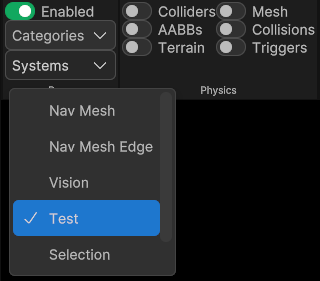
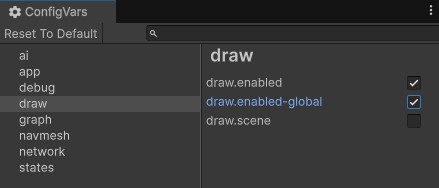

# BovineLabs Quill
BovineLabs Quill is a debug drawing library for entities.

Access and updates are provided on [Buy Me a Coffee](https://buymeacoffee.com/bovinelabs) and support on [Discord](https://discord.gg/RTsw6Cxvw3).

## Installation

Quill is currently provided as a zip file containing itself and its dependencies. To install, extract it to your Unity `ProjectName/Packages` folder.

Quill depends on the base version of BovineLabs Core, which should be included in the release.

While technically optional, Quill is designed to work with BovineLabs Anchor, which integrates with the toolbar to control various drawing systems.

Unless you plan to integrate it with your own systems, it is recommended to use Anchor.

For setup instructions, refer to the Anchor README, included in the package or available online [here](https://gitlab.com/tertle/com.bovinelabs.anchor/-/blob/main/README.md#setup).

## Drawer

The standard way of using the library is to request a `Drawer`, pass it to a job, and use it to draw.

It currently supports the following draw types:

### Lines
- Point
- Line
- Lines
- Ray
- Arrow
- Plane
- Circle
- Arc
- Cone
- Cuboid
- Sector
- Triangle
- Quad
- Cylinder
- Capsule
- Sphere

### Solids
- SolidQuad
- SolidTriangle
- SolidTriangles

### Text
Text can be displayed as a billboard, always facing the camera, or with a fixed orientation in the world.
- Text32
- Text64
- Text128
- Text512
- Text4096

### Example

```csharp
public partial struct TestSystem : ISystem
{
    [BurstCompile]
    public void OnUpdate(ref SystemState state)
    {
        var drawer = SystemAPI.GetSingleton<DrawSystem.Singleton>().CreateDrawer<TestSystem>();

        // Optional, but lets you early out if this drawer isn't currently enabled.
        // This allows you to avoid scheduling jobs and writing draw data that will be discarded anyway.
        if (!drawer.IsEnabled)
        {
            return;
        }

        new TestDrawJob { Drawer = drawer }.Schedule();
    }

    [BurstCompile]
    private partial struct TestDrawJob : IJobEntity
    {
        public Drawer Drawer;

        private void Execute(Entity entity, in LocalTransform lt)
        {
            this.Drawer.Text128(lt.Position, entity.ToFixedString(), Color.red);
        }
    }
}
```

### CreateDrawer

The above example used the `CreateDrawer<TestSystem>()` generic variation. By using this, the drawer is automatically registered to the system and added to the System list in the toolbar.

`CreateDrawer<T>(FixedString32Bytes category = default)` also has an optional category parameter that you can use if you want to group drawers by category, allowing you to toggle them all on and off easily.



If you don't use `BovineLabs Anchor` or the toolbar, or if you have some other custom tooling to control the drawer, you can use the non-generic version, `CreateDrawer()`. 
This means the `Drawer` won't be added to the filtering list and will always draw, as long as drawing is globally enabled.  
For example, this is the approach used by the included physics drawer.

### Duration

All `Drawer` methods have an overload for duration, allowing drawings to persist for a set amount of time.  
This is particularly useful for visualizing one-shot events, as it lets you pause and inspect them.

## GlobalDraw

Quill also comes with a `GlobalDraw` option that requires no setup. 
It can be safely called from the main thread or any job worker thread, and it provides access to all the same draw commands available on `Drawer`.

There are a few things to consider before using `GlobalDraw`:

- `GlobalDraw` is intended only for quick debugging code, not for persistent debug systems.
- Unlike `Drawer`, `GlobalDraw` is only available in the editor and will not be included when `BL_DEBUG` is defined.
- Enabling `GlobalDraw` creates a synchronization point between all Worlds to ensure safety.

### Drawing in Editor

`GlobalDraw` can also be used outside of play mode in the Editor. However, it's important to note that events like `EditorApplication.update` can trigger dozens of times per render update.

Apart from being bad for performance, this can cause drawings, particularly text, to appear bold and hard to read. To avoid this, you can use `FrameUtility` to ensure drawing occurs only once per frame.

```csharp
[InitializeOnLoad]
public class DrawTest
{
    static DrawTest()
    {
        EditorApplication.update += Update;
    }

    private static void Update()
    {
        if (FrameUtility.IsNewFrame<DrawTest>())
        {
            GlobalDraw.Text64(float3.zero, "Test text", Color.white, 32);
        }
    }
}
```

### Enabling

`GlobalDraw` must be manually enabled using the `draw.enabled-global` ConfigVar, which can be accessed from the **ConfigVar Window** under `BovineLabs -> ConfigVar`.  
Once you're done debugging, you should disable it again to avoid unnecessary synchronization overhead.

Note: When running in editor world GlobalDraw is always enabled to make editor tooling 



### Example

```csharp
[BurstCompile]
partial struct TestDrawJob : IJobEntity
{
    private static void Execute(Entity entity, in LocalTransform lt)
    {
        GlobalDraw.Text128(lt.Position, entity.ToFixedString(), Color.red);
    }
}
```